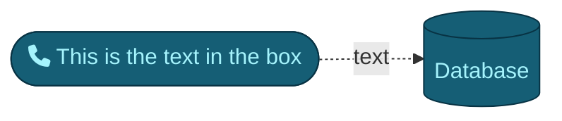
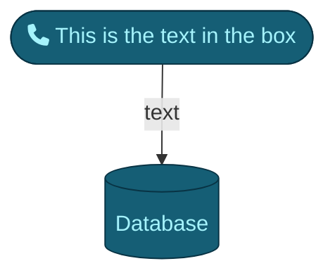

---
tags:
  - doc
---
Welcome to the official Obsidian Help site, where you can find tips and guides on how to use [Obsidian](https://obsidian.md/)
# Getting started
If you're new to Obsidian, learn the basics of note-taking with Obsidian.
## Basic formatting syntax
Learn how to apply basic formatting to your notes[^1], using [Markdown](https://daringfireball.net/projects/markdown/).
Text inside `backticks` on a line will be formatted like code. 😀
This is an inline math expression $\sum_{i=0}^n i^2 = \frac{(n^2+n)(2n+1)}{6}$.

### Syntax

```python
if __name__ == "__main__":
    print("{title} \n".format(title=TITLE))

    template = Template("default")
    template.create()
```
### Callouts

> [!tip] Callouts can have custom titles > Tip

> [!info] Callouts can have custom titles > Info

> [!note] Callouts can have custom titles > Note

> [!question] Callouts can have custom titles > Question

> [!example] Callouts can have custom titles > Example

> [!warning] Callouts can have custom titles > Warning

### Quotes

> Human beings face ever more complex and urgent problems, and their effectiveness in dealing with these problems is a matter that is critical to the stability and continued progress of society.

### Tables

| C1  | C2  | C3  | C4  |
| --- | --- | --- | --- |
| 123 | 456 | 789 |     |
| 000 | 111 | 222 | 22  |


### PlantUML
```plantuml
skinparam defaultFontColor white
skinparam arrowColor white
skinparam BackgroundColor #262626
skinparam defaultFontName Avenir
skinparam actorStyle awesome
skinparam ActorBorderColor #939596
skinparam DefaultTextAlignment center
database "<b>Data</b>" as db #155e75;text:white
database "<b>Data</b>" as db2 #155e75;text:white
node "<b>Node</b>" as node1  #155e75;text:white
actor "<b>Developer</b>" as DEVELOPER #155e75;text:white

node1 -> db : hello
db -> db2 : hello
```
### Mermaid




Make a note of something, [[create a link]], or try [the Importer](https://help.obsidian.md/Plugins/Importer)!

[^1]: This is the referenced text.